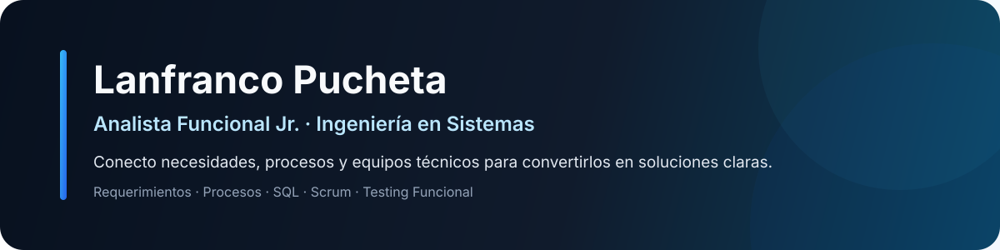
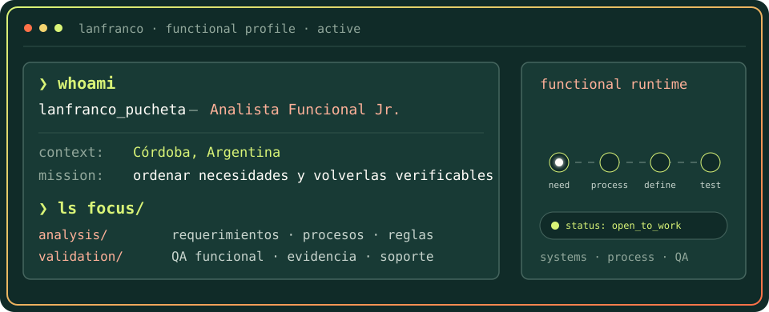
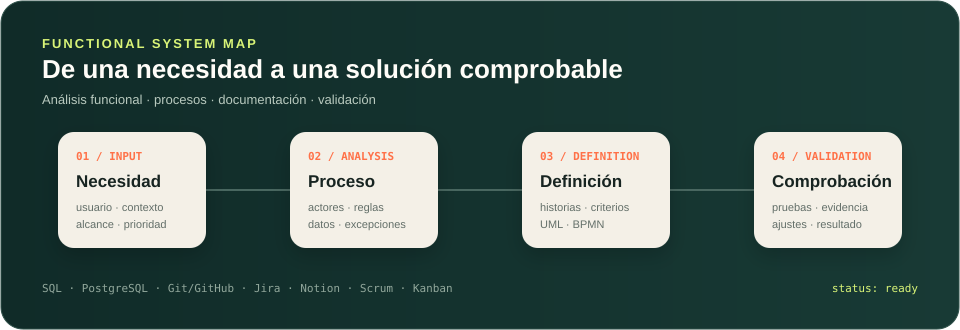

  

  

  

---

## `$ whoami`

  

  <a href="https://lanfranco-pucheta-portfolio.onrender.com"><strong>Portfolio</strong></a>
  &nbsp;&nbsp;·&nbsp;&nbsp;
  <a href="https://www.linkedin.com/in/lanfranco-pucheta"><strong>LinkedIn</strong></a>
  &nbsp;&nbsp;·&nbsp;&nbsp;
  <strong>Córdoba, Argentina</strong>

---

## `$ cat functional-stack.yml`

<table>
  <thead>
    <tr>
      <th colspan="2" align="left"><code>lanfranco@systems:~$ cat functional-stack.yml</code></th>
    </tr>
  </thead>
  <tbody>
    <tr>
      <td width="50%" valign="top">
        <code>├─ ◈ functional_analysis:</code>  
        <strong>Requerimientos · Historias de usuario</strong> 
        Criterios de aceptación · Reglas de negocio 
        UML · BPMN · Documentación funcional
      </td>
      <td width="50%" valign="top">
        <code>├─ ✓ validation_support:</code>  
        <strong>Pruebas funcionales · Casos de prueba</strong> 
        Revisión de funcionalidades · Evidencia 
        Soporte de aplicaciones · Seguimiento
      </td>
    </tr>
    <tr>
      <td valign="top">
        <code>├─ ◉ data_systems:</code>  
        <strong>SQL · PostgreSQL · MongoDB</strong> 
        Calidad de datos · Consistencia 
        Análisis y actualización de información
      </td>
      <td valign="top">
        <code>╰─ ↔ delivery_collaboration:</code>  
        <strong>Scrum · Kanban · Jira · Notion</strong> 
        Git · GitHub · Product Backlog 
        Trabajo con Desarrollo / QA
      </td>
    </tr>
  </tbody>
  <tfoot>
    <tr>
      <td colspan="2"><code>status: ready · focus: functional_analysis · environment: real_projects</code></td>
    </tr>
  </tfoot>
</table>

---

## `$ run workflow --mode functional`

  

---

## `$ ls ./projects`

### AlDía · HealthTech
**Análisis funcional · Frontend · UX · Testing funcional**

Participo en el desarrollo y evolución de una plataforma orientada al seguimiento de pacientes. Trabajo sobre análisis de funcionalidades, requerimientos de interfaz, experiencia de usuario, pruebas funcionales y mejoras del producto en colaboración con el equipo técnico.

### OncoView · Gestión de Historias Clínicas
**Requerimientos · Documentación · Scrum · Revisión funcional**

Proyecto de Seminario UTN orientado a la gestión de historias clínicas. Trabajo sobre requerimientos, historias de usuario, criterios de aceptación, documentación funcional, Product Backlog y revisión de funcionalidades.

### Red Sísmica · Patrón Iterator
**C# · Diseño de sistemas · Documentación · Validación**

Caso público para recorrer y revisar eventos sísmicos separando responsabilidades de recorrido y dominio.  
[Demo](https://lanfranco-pucheta-portfolio.onrender.com/projects/red-sismica-iterator/web/) · [Código y documentación](https://github.com/Lann206/portfolio-lanfranco/tree/main/projects/red-sismica-iterator)

### Mesa de incidentes · Soporte de Aplicaciones
**Incidentes · Priorización · SLA · Casos de prueba**

Prototipo público para registrar, priorizar y seguir incidentes con reglas visibles de prioridad y vencimiento.  
[Demo](https://lanfranco-pucheta-portfolio.onrender.com/projects/incident-sla/) · [Reglas y pruebas](https://github.com/Lann206/portfolio-lanfranco/tree/main/projects/incident-sla)

> **Privacidad:** AlDía, OncoView y Bomvino se mantienen en repositorios privados. No publico código, documentación interna ni información sensible de esos proyectos.

---

## `$ cat education.txt`

**Ingeniería en Sistemas de Información**  
Universidad Tecnológica Nacional · Facultad Regional Córdoba  
Estudiante avanzado · Materias de 4.º y 5.º año · Aproximadamente 70 % de la carrera aprobada.

---

## `$ connect --professional`

  
  &nbsp;
  
  &nbsp;
  

<code>Analista Funcional Jr. · Sistemas · Córdoba, Argentina</code>

